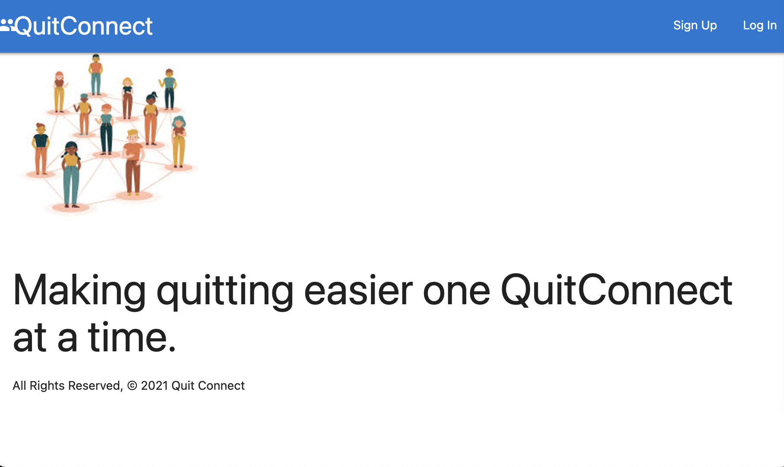
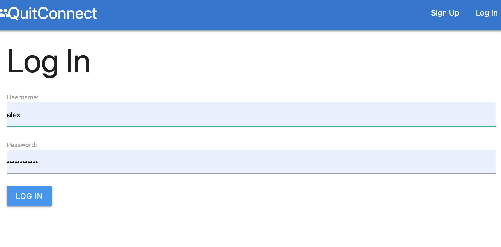
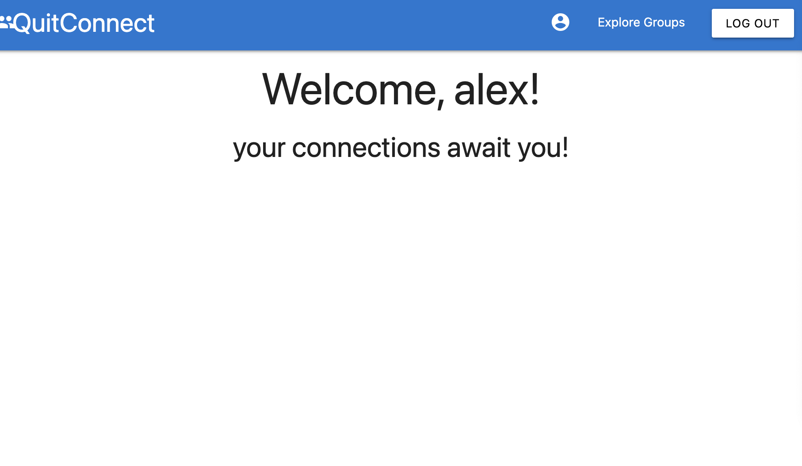
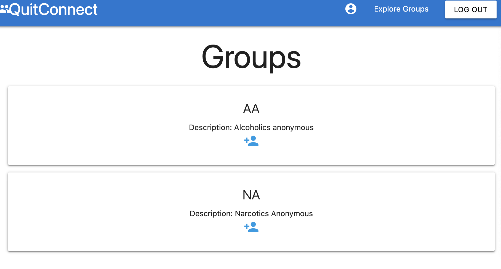
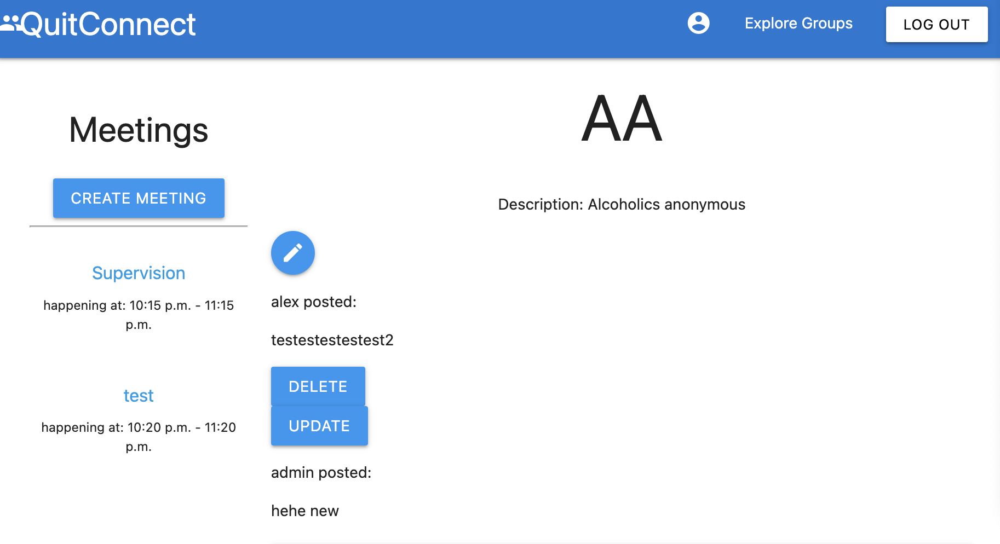
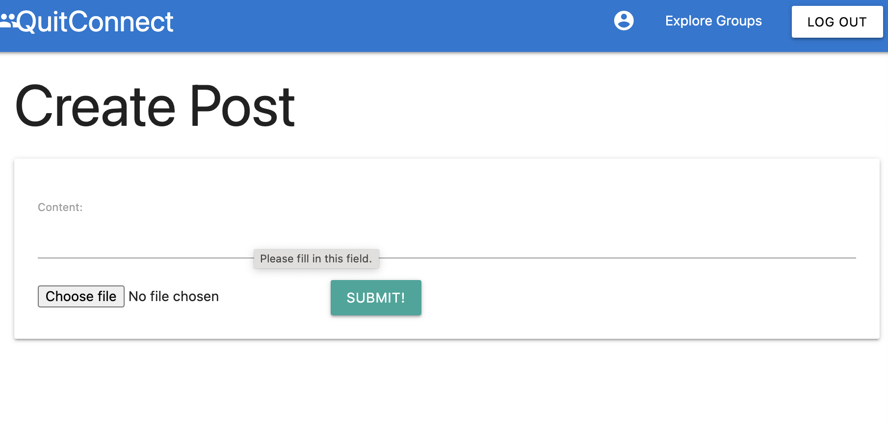
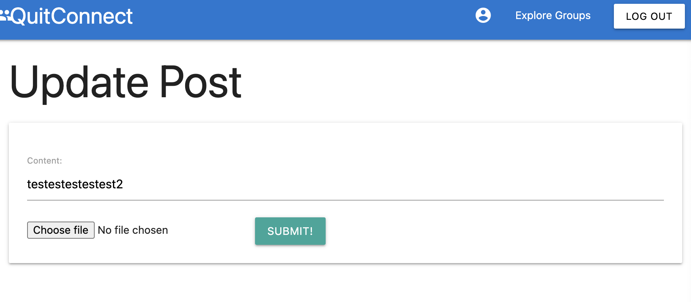

# APP USAGE 

# QUITCONNECT 
A social media site designed as an online more accesible support group for quitting addictions.
QuitConnect allows users onced signed up to login and join groups of their joice. Once a user
has joined their online support group or groups they can make upload photos or post on their acheivements or struggles
the user can edit or delete the posts at any point. Users also have the option to schedule meetings with other 
users of the groups if they feel they need to connect further.

# TECH STACK 
- Python
- Django
- Materialize 
- Render 
- AWS
- PSQL

# GETTING STARTED
render - QuitConnect:https://quitconnect.onrender.com
Pitch Deck - https://docs.google.com/presentation/d/1GidKxiSYt3fr6BzDOy9q2yBsdJz6J8pXoEGN9Kch6FA/edit?usp=sharing

# ICE BOX ITEMS 
As a admin user, I want be able to authorise people to join the groups, because some users might want to share their struggles only people in similar situations/addiction.
‌

As a user, I want to be able to view all my posts in one page, so I can revisit them, update or delete them with ease.
‌

As a user, I want to be able to create meeting calls, so that other people can join and share.
‌

As a user, I want to have full control of the meeting room I’m creating, including number of participants, date and time, so I can feel as comfortable as possible to share my experience.

